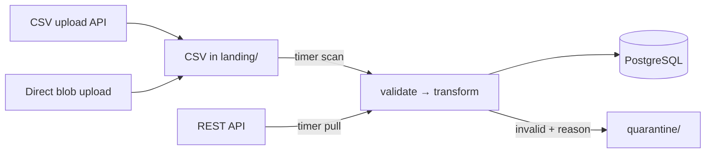

# Student Data Ingestion Pipeline

Ingests student records from CSV files and a REST API on a schedule, validates them, normalizes
them into one schema, and idempotently upserts them into PostgreSQL.

Azure (Functions Flex Consumption + PostgreSQL Flexible Server). Runs and tests locally with no
Azure account.



- Architecture and file-by-file map: `[docs/ARCHITECTURE.md](docs/ARCHITECTURE.md)`
- Test scenarios and results: `[docs/TEST_RESULTS.md](docs/TEST_RESULTS.md)`
- Why it is built this way: `[docs/decisions/](docs/decisions/README.md)`
- Accepted downsides: `[docs/TRADEOFFS.md](docs/TRADEOFFS.md)`
- Mistakes made and fixed: `[docs/LEARNINGS.md](docs/LEARNINGS.md)`
- Scaling beyond current limits: `[docs/SCALING.md](docs/SCALING.md)`

## Setup, execution, and configuration

Full step-by-step instructions (local run, tests, environment variables, and cloud deployment
inputs) are in `[docs/DEPLOY.md](docs/DEPLOY.md)`. Environment variable reference with defaults
and comments is in `[.env.example](.env.example)`.

Quick start:

```bash
python -m venv .venv
.venv\Scripts\activate
pip install -r requirements-dev.txt
copy .env.example .env          # then set PG_USER and PG_PASSWORD

psql -h localhost -U <PG_USER> -d postgres -c "CREATE DATABASE students;"
python -m src.cli init-db

mkdir .localstore\landing
copy samples\students_valid.csv .localstore\landing\
python -m src.cli csv
```

See `[docs/DEPLOY.md](docs/DEPLOY.md)` for the API path, running tests, and deploying to Azure via
GitHub Actions.

## Known limitations

- Verified locally only. Terraform in `infra/` has not been applied to a real Azure subscription,
`.github/workflows/deploy.yml` has not run against Azure, and Application Insights alerts are
defined but not confirmed to fire.
- Native Excel workbooks (`.xlsx`) are rejected; export to `.csv` first.
- A wrong-schema file dropped directly into Blob Storage (bypassing the upload API) quarantines
row-by-row, not as one clear "wrong file type" error.
- Quarantine records are overwritten on retry; if the same chunk fails twice, only the latest
failure's quarantine record is kept, not a history of every attempt.
- No queue-based fan-out; ingestion is sequential per scheduled run
(`[docs/TRADEOFFS.md](docs/TRADEOFFS.md)`).
- At-least-once processing, not exactly-once; safety comes from idempotent upserts, not delivery
guarantees.
- New source fields are not auto-mapped. They land safely in `raw_payload` (JSONB) until someone
adds a `db/*.sql` migration and a `transform.py` mapping; `deploy.yml` then applies that migration
automatically on the next push.

## Expected third-party API contract

`src/ingest/api_source.py` expects this vendor API shape.

**Token:** OAuth2 client credentials (default, `API_AUTH_TYPE=oauth2_client_credentials`).

```http
POST {API_TOKEN_URL}
grant_type=client_credentials&client_id={API_CLIENT_ID}&client_secret={API_CLIENT_SECRET}
```

```json
{ "access_token": "opaque-string", "expires_in": 3600 }
```

For a vendor that issues one long-lived token instead, set `API_AUTH_TYPE=static_token` and
`API_STATIC_TOKEN`. Terraform currently wires only the OAuth2 flow into Key Vault, so
`static_token` is local/dev-only until that's added.

**Page:** incremental student updates.

```http
GET {API_BASE_URL}{API_STUDENTS_PATH}?updated_since=2026-07-31T12:00:00Z&page=1&page_size=100
Authorization: Bearer {access_token}
```

Omit `updated_since` on the first run.

**Response**:

```json
{
  "next_page": 2,
  "data": [
    { "student_id": "S1001", "first_name": "Ava", "last_name": "Nguyen",
      "grade_level": 10, "school_id": "SCH-01", "email": "ava@example.edu",
      "enrollment_status": "active", "updated_at": "2026-07-31T10:00:00Z",
      "guardian_contact": "+1-206-555-0101" }
  ]
}
```

- Records can be under `data`, `students`, `items`, `results`, or a top-level array.
- Pagination uses `next_page`, `next`, or `next_url`. Missing/null means the last page.
- Non-advancing or repeated pages fail the run.
- Required fields: `student_id`, `first_name`, `last_name`, `school_id`, `email`,
`enrollment_status`, `updated_at`. Other fields go to `raw_payload`.
- HTTP errors, retries, and 401 handling use the shared retry policy.

## Assumptions

- The vendor API matches the contract above.
- `updated_at` is trustworthy and monotonic per record. It decides which write wins.
- CSV and API `updated_at` timestamps are assumed to use ISO 8601 UTC, e.g.
`2026-07-31T10:00:00Z`.
([ITD-005](docs/decisions/ITD-005-bad-record-policy.md)).
- The scheduled CSV job also reads only `.csv` objects from `landing`.
- CSVs arrive in Blob Storage directly or through the upload API. Both paths land in the same
`landing` container ([ITD-007](docs/decisions/ITD-007-csv-trigger-strategy.md)).
- If a CSV has duplicate column headers (e.g. two `email` columns), the last one wins.
- Grade level must be a plain integer; decimals like `9.5` and labels like `TK` or `Grade 9` are
rejected, not normalized.

