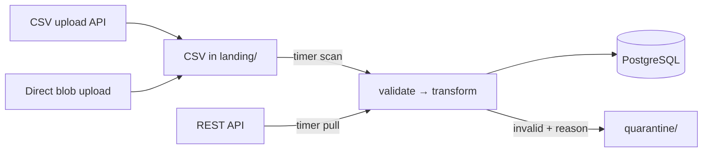

# Student Data Ingestion Pipeline

Ingests student records from CSV files and a REST API on a schedule, validates them, normalizes
them into one schema, and idempotently upserts them into PostgreSQL.

Azure (Functions Flex Consumption + PostgreSQL Flexible Server). Runs and tests locally with no
Azure account.



- Architecture and file-by-file map: [`docs/ARCHITECTURE.md`](docs/ARCHITECTURE.md)
- Local run, tests, and deploy inputs: [`docs/DEPLOY.md`](docs/DEPLOY.md)
- Settings reference: [`.env.example`](.env.example)
- Why it is built this way: [`docs/decisions/`](docs/decisions/README.md)
- Accepted downsides: [`docs/TRADEOFFS.md`](docs/TRADEOFFS.md)

## Expected third-party API contract

`src/ingest/api_source.py` expects this vendor API shape.

**Token:** OAuth2 client credentials.

```http
POST {API_TOKEN_URL}
grant_type=client_credentials&client_id={API_CLIENT_ID}&client_secret={API_CLIENT_SECRET}
```
```json
{ "access_token": "opaque-string", "expires_in": 3600 }
```

**Page:** incremental student updates.

```http
GET {API_BASE_URL}{API_STUDENTS_PATH}?updated_since=2026-07-31T12:00:00Z&page=1&page_size=100
Authorization: Bearer {access_token}
```

Omit `updated_since` on the first run.

**Response**:

```json
{
  "next_page": 2,
  "data": [
    { "student_id": "S1001", "first_name": "Ava", "last_name": "Nguyen",
      "grade_level": 10, "school_id": "SCH-01", "email": "ava@example.edu",
      "enrollment_status": "active", "updated_at": "2026-07-31T10:00:00Z",
      "guardian_contact": "+1-206-555-0101" }
  ]
}
```

- Records can be under `data`, `students`, `items`, `results`, or a top-level array.
- Pagination uses `next_page`, `next`, or `next_url`. Missing/null means the last page.
- Non-advancing or repeated pages fail the run.
- Required fields: `student_id`, `first_name`, `last_name`, `school_id`, `email`,
  `enrollment_status`, `updated_at`. Other fields go to `raw_payload`.
- HTTP errors, retries, and 401 handling use the shared retry policy.

## Assumptions

- The vendor API matches the contract above.
- `updated_at` is trustworthy and monotonic per record. It decides which write wins.
- Ambiguous dates are rejected, not guessed ([ITD-005](docs/decisions/ITD-005-bad-record-policy.md)).
- CSVs arrive in Blob Storage directly or through the upload API. Both paths land in the same
  `landing` container ([ITD-007](docs/decisions/ITD-007-csv-trigger-strategy.md)).
