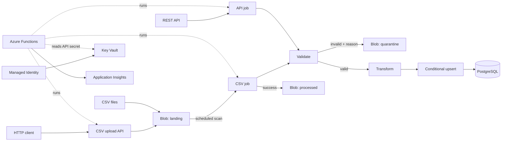

# Architecture

This document describes the current system.   
The root `README.md` is the project overview.
[DEPLOY.md](./DEPLOY.md) contains local run and deployment inputs. The
[decision index](./decisions/README.md) explains the main technical choices.
[SCALING.md](./SCALING.md) explains current scaling and the future fan-out path.

## Current status

The pipeline and its tests run locally without an Azure account. Terraform is valid but has not
been applied to a real Azure subscription. The deployment workflow has also not run against Azure.

## System flow

1. A CSV is uploaded directly to Blob Storage or through the HTTP upload API.
2. The CSV timer scans `landing`, or the API timer starts an incremental pull.
3. Ingestion reads bounded chunks. The API client also handles authentication, pagination, and
  retries.
4. Validation separates valid and invalid records.
5. Invalid records go to `quarantine` with the original data and a reason code. The batch
  continues.
6. Valid records are transformed into the canonical student model.
7. PostgreSQL accepts a row only when it is new or has a newer `updated_at`.
8. A successful CSV file moves to `processed` only if the blob still matches the scanned ETag.
9. Structured logs record the correlation ID, counts, duration, and outcome.

## Main components

### Ingestion

- `src/ingest/csv_source.py` streams CSV files in chunks. It does not load a full file into memory.
Malformed rows are kept for validation so they can be quarantined with a line number.
- `src/ingest/api_source.py` reads one API page at a time. It supports page-number and continuation
pagination, retries safe failures, and stops repeated or non-advancing pages.
- `src/ingest/api_auth.py` keeps authentication separate from pagination. The current OAuth2
client-credentials implementation caches and refreshes access tokens.
- `src/http.py` contains shared HTTP retry rules and parses both supported `Retry-After` formats.

### Validation and transformation

- `src/validate.py` applies required-field, type, email, duplicate, and format rules. Within a
chunk, it keeps the newest record for each `student_id`.
- `src/transform.py` maps valid input to the canonical schema. The result is deterministic: the
same input always gives the same student.
- `src/models.py` defines the canonical records, quarantine reason codes, and run summaries.
- `src/quarantine.py` writes rejected records as JSON Lines. Stable file names make retries
idempotent.

### Persistence and orchestration

- `src/persist.py` owns PostgreSQL access, conditional upserts, run claims, progress, migrations,
and API watermarks.
- Bulk writes use a session-scoped temporary staging table. Its schema and merge SQL stay together
in `src/persist.py`.
- `src/pipeline.py` runs the shared chunk loop. CSV and API jobs add their own claim and checkpoint
rules around that loop.
- `src/retry.py` provides exponential backoff with jitter and honors `Retry-After`.

### Triggers

- `triggers/csv.py` scans `landing` on `CSV_SCHEDULE_CRON`.
- `triggers/api.py` polls the API on `API_SCHEDULE_CRON`.
- `triggers/upload.py` accepts a function-key-protected CSV upload and writes it to `landing`.
- `function_app.py` only registers these trigger blueprints.

Azure Functions imports stay in `triggers/` and `function_app.py`. The shared pipeline in `src/`
can therefore run in unit tests and from `python -m src.cli`.

## Data and storage

### Canonical student

Required source fields:

- `student_id`
- `first_name`
- `last_name`
- `grade_level`
- `school_id`
- `email`
- `enrollment_status`
- `updated_at`
- `guardian_contact`

Internal fields are `source_system`, `raw_payload`, and `ingested_at`.

`student_id` is the primary key. `school_id` and `updated_at` are indexed. The schema is in
`db/001_schema.sql`.

### Blob containers

- `landing`: CSV files waiting for processing.
- `processed`: CSV files completed successfully.
- `quarantine`: invalid records and machine-readable reasons.

`src/storage.py` provides the common object-store interface. Local runs use folders. Azure runs
use Blob Storage through managed identity.

Each CSV download and archive move is conditional on the ETag found during the scan. If the blob
changes before or during processing, that file fails or stays in `landing`. Other files continue.
The changed version is eligible for a new run on the next scan.

### Database state

- `students` stores the current canonical record.
- `ingest_run` claims work by source object, object version, and chunk size. It stores the last
completed chunk for that exact claim.
- `api_checkpoint` stores the last successful API watermark.
- `schema_migrations` records applied `db/NNN_*.sql` files.

The upsert uses `student_id` and accepts an update only when the incoming `updated_at` is newer.
This makes retries and repeated input safe.

## Security

- The Function App uses managed identity for Blob Storage, Key Vault, and PostgreSQL.
- PostgreSQL uses Microsoft Entra authentication. No database password is stored in Azure config.
- Shared storage keys are disabled.
- The vendor OAuth2 client secret is the only stored application secret. It lives in Key Vault and
is exposed to the Function App through a Key Vault reference.
- Terraform writes only a placeholder secret. The live value is set outside Terraform, so it does
not enter code, configuration, or Terraform state.
- GitHub Actions uses OIDC to obtain short-lived Azure access. It stores no Azure client secret.

## Failure handling

- Invalid record: quarantine it and continue the batch.
- API `429`: honor `Retry-After`, then retry with backoff.
- Retryable API `5xx`: retry with backoff and jitter; fail and alert after the limit.
- Database unavailable: retry; leave CSV input in `landing`.
- Interrupted run: resume from the saved chunk for the same object version and chunk size. Stale
`running` runs are reclaimed after the configured lease window.
- Older record: make the upsert a no-op.
- Repeated run: use the run claim and idempotent upsert to avoid duplicate effects.
- Missed or failed run: send an Application Insights alert.

## Infrastructure and deployment

Terraform in `infra/` creates:

- storage accounts and blob containers;
- PostgreSQL Flexible Server;
- the Function App and Flex Consumption plan;
- managed identity and role assignments;
- Key Vault;
- Log Analytics, Application Insights, and alerts.

`.github/workflows/ci.yml` runs formatting, lint, tests with a temporary PostgreSQL service, and
Terraform validation.

On a push to `main`, `.github/workflows/deploy.yml` applies infrastructure, grants the Function App
database role, applies pending migrations, and publishes the function code in that order.

## Important guarantees

1. Pipeline logic is testable without Azure.
2. The database prevents duplicates and stale overwrites.
3. Chunks and checkpoints make interrupted work safe to retry.
4. Invalid records never stop a batch.
5. Schedules, endpoints, and credentials come from configuration.
6. Secrets do not enter code, committed config, logs, or Terraform state.

