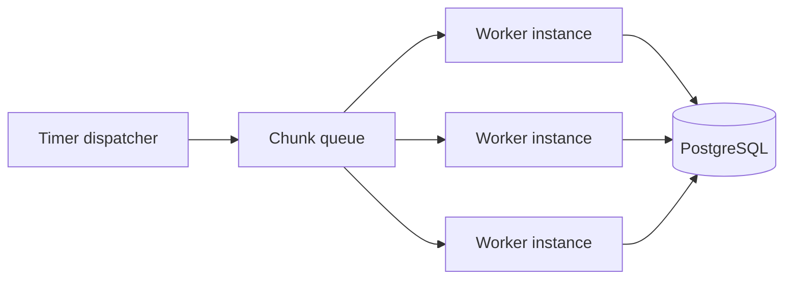

# Scaling

## Current design

Two timer-triggered functions: 

CSV scans `landing` on `CSV_SCHEDULE_CRON`;   
API pulls updates on `API_SCHEDULE_CRON`.   
Azure allows only one active invocation per function, so files/pages within  
each job run one after another. The app scales to zero when idle; Terraform caps it at 40  
instances, but nothing fans a single job out across them yet.

CSV and API have separate timer locks, so they can run at the same time as each other (possibly on
different host instances), but each job's own work stays sequential. This is safe because
PostgreSQL writes use transactions and conditional upserts.

The current design still handles larger inputs safely:

- CSV files are streamed, not loaded fully into memory.
- API responses are read one page at a time.
- Records are committed in bounded chunks.
- Checkpoints make failed or stale runs safe to resume.
- Conditional upserts make repeated work safe.

## Future scale-out design

Add queue-based workers only when load tests show sequential processing can't meet the required
completion time.

The timer becomes a dispatcher:

1. CSV: enqueue one task per file (or per chunk blob, for very large files).
2. API: follow pagination in order, enqueue each fetched page. Fetch pages in parallel only if the
  vendor guarantees independent page access and a consistent snapshot.
3. Queue-triggered workers validate, transform, quarantine, and upsert chunks independently.
4. Archive a CSV file or advance the API watermark only after every task in the run succeeds.

Start with 4–8 worker instances; raise the limit only after checking PostgreSQL connections, API
rate limits, and run duration.

## When to change

Adopt the queue-worker design when one or more of these conditions is measured:

- jobs regularly approach the 1-hour timeout;
- pending files cannot finish before the next schedule;
- a completion-time requirement cannot be met sequentially; or
- load tests show that PostgreSQL and the vendor API can support safe parallelism.

Until then, keep the current design. It is simpler to operate and test.