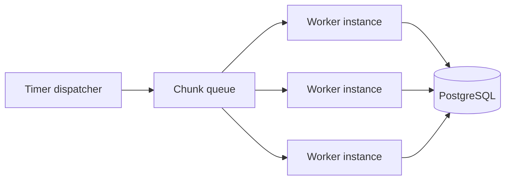

# Scaling

## Current design

The Function App has two timer-triggered functions:

- CSV scans `landing` on `CSV_SCHEDULE_CRON`.
- API pulls updates on `API_SCHEDULE_CRON`.

Azure allows only one active invocation of each timer-triggered function. Multiple CSV files are
processed one after another. API pages are also fetched and processed one after another.

The app can scale to zero when both jobs are idle. Terraform sets the default maximum to 40
instances, but the current design does not fan out one job across that capacity.

### Overlapping CSV and API schedules

CSV and API have separate timer locks. A CSV run blocks only the next CSV run. An API run blocks
only the next API run.

If both schedules fire together, both jobs can run at the same time. Azure may place them on the
same host instance or different instances. Inside each job, work is still sequential: CSV files run
one by one, and API pages run one by one.

This is safe because PostgreSQL writes use transactions and conditional upserts. Offset the
schedules only if load tests show database, memory, or vendor API pressure.

The current design still handles larger inputs safely:

- CSV files are streamed instead of loaded into memory.
- API responses are read one page at a time.
- Records are committed in bounded chunks.
- Checkpoints make failed or stale interrupted runs safe to resume.
- Conditional database upserts make repeated work safe.

This is the recommended design for the current workload: small daily CSV files and incremental API
updates.

## Future scale-out design

Add queue-based workers only when load tests show that sequential processing cannot meet the
required completion time.

The timer becomes a dispatcher:

1. For CSV, enqueue one task per file. Split very large files into stable chunk blobs and enqueue
   one task per chunk.
2. For API, follow pagination in order, then enqueue each fetched page for processing. Fetch pages
   in parallel only if the vendor guarantees independent page access and a consistent snapshot.
3. Queue-triggered workers validate, transform, quarantine, and upsert chunks independently.
4. Archive a CSV file or advance the API watermark only after every task in the run succeeds.

Queue backlog gives Azure work it can distribute across Function instances. Start with 4–8 worker
instances and increase the limit only after checking PostgreSQL connections, API rate limits, and
run duration.

## When to change

Adopt the queue-worker design when one or more of these conditions is measured:

- jobs regularly approach the 1-hour timeout;
- pending files cannot finish before the next schedule;
- a completion-time requirement cannot be met sequentially; or
- load tests show that PostgreSQL and the vendor API can support safe parallelism.

Until then, keep the current design. It is simpler to operate and test.
